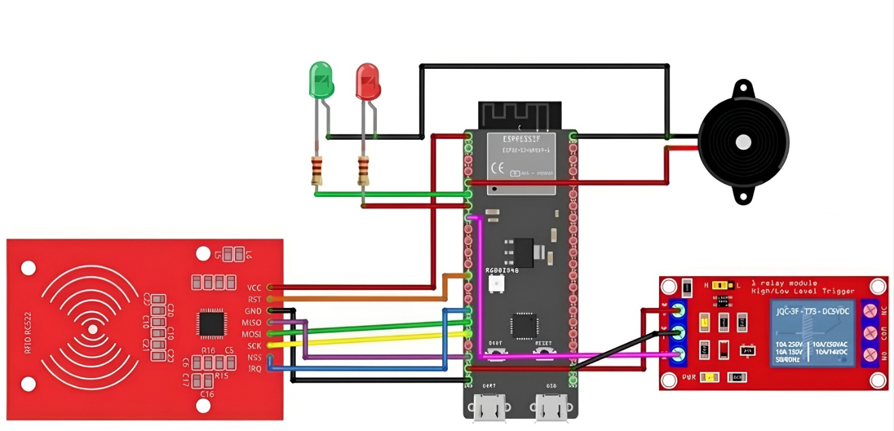
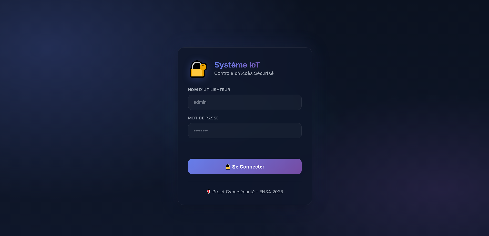
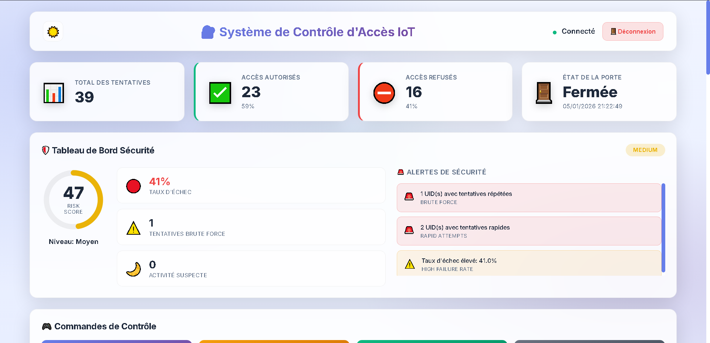
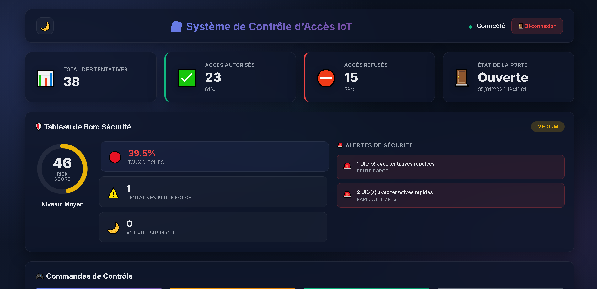
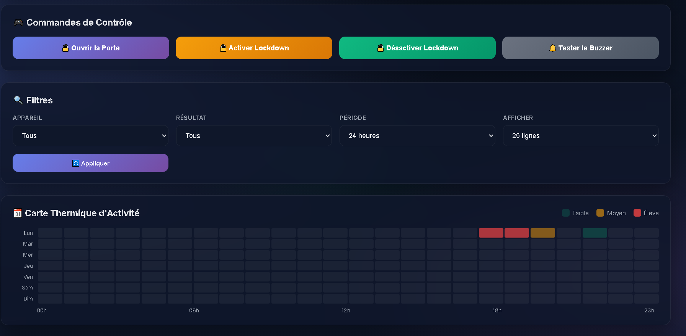
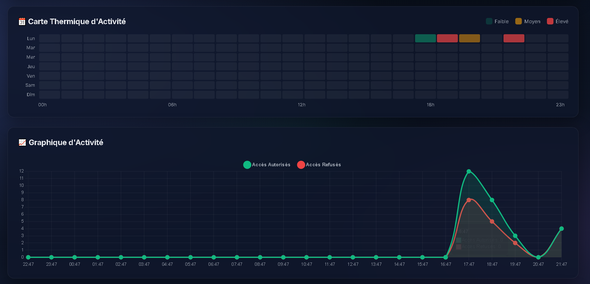
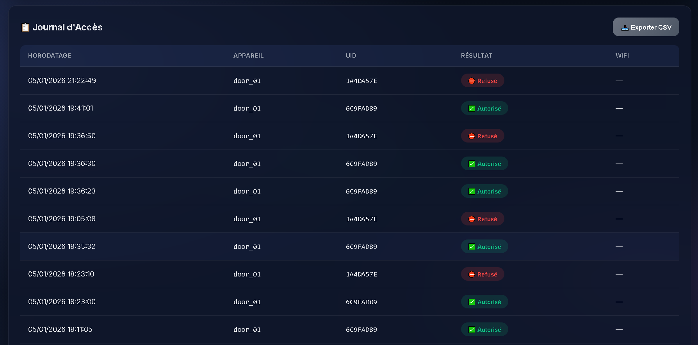

# 🔐 IoT Access Control System (ESP32 + RFID) with Web Supervision Dashboard

A complete **IoT access control** project using **ESP32 + RFID** with a modern **real-time Web Dashboard** powered by **FastAPI** and **SQLite**. The system logs every access attempt (**GRANTED / DENIED**), monitors door status, provides **security analytics (risk score + alerts)**, and supports **remote control commands** (open door, lockdown, buzzer test).

---

## 🎥 Demo

- **YouTube demo:** [https://youtu.be/ON90uifTUuU](https://youtu.be/ON90uifTUuU)
- **Canva presentation:** _([CANVA PRESENTATION](https://www.canva.com/design/DAG9ZJmVTqA/PKFPvwCegPuGgWIxqx2piA/edit?utm_content=DAG9ZJmVTqA&utm_campaign=designshare&utm_medium=link2&utm_source=sharebutton))_

---

## ✨ Key Features

- ✅ RFID access control (authorized/unauthorized)
- ✅ Visual & sound feedback: **LEDs + Buzzer**
- ✅ Stores all events in **SQLite**
- ✅ Modern Web Dashboard:
  - KPIs: total attempts, granted, denied, door status, last update
  - Charts: activity (GRANTED vs DENIED)
  - Heatmap: peak usage hours (hours × days)
  - Access logs with filtering + **CSV export**

- ✅ Remote control:
  - **Open door**
  - **Lockdown ON/OFF**
  - **Buzzer test**

- ✅ Security analytics:
  - Failure rate
  - Brute-force detection
  - Suspicious-time activity detection
  - Risk score + risk level (LOW / MEDIUM / HIGH / CRITICAL)

---

## 🧰 Tech Stack

### Hardware

- ESP32 (e.g., ESP32-S3)
- RFID reader (MFRC522)
- Relay module (door lock control)
- LEDs (Red/Green) + resistors
- Active buzzer
- Breadboard + jumper wires

### Software

- Backend: **FastAPI**
- Database: **SQLite**
- Frontend: **HTML / CSS / JavaScript**
- Charts: **Chart.js**
- REST API (JSON)

---

## 🏗️ System Architecture

1. **ESP32** reads the RFID UID from the MFRC522 module.
2. ESP32 sends events to the **FastAPI server** via REST API.
3. The server stores logs in **SQLite** and computes stats + security metrics.
4. The **Web Dashboard** displays live logs/analytics and sends remote commands.

---

## 🧾 Wiring Diagram (ESP32 + RFID + Relay + LEDs + Buzzer)




---

## 📸 Screenshots


### 1) Login



### 2) Dashboard (Light Mode)



### 3) Dashboard (Dark Mode)



### 4) Control Commands & Filters



### 5) Activity Heatmap & Activity Chart



### 6) Access Log & CSV Export



---

## 📁 Project Structure

Recommended structure (matches the FastAPI static folder setup):

```text
.
├── esp32_rfid/                  # ESP32 firmware (.ino)
├── web/                         # Dashboard files (index.html, app.js, style.css, ...)
├── server.py                    # FastAPI backend server
├── requirements.txt             # Python dependencies
├── assets/
│   ├── wiring/
│   │   └── wiring-diagram.png
│   └── screenshots/
│       ├── 01-login.png
│       ├── 02-dashboard-light.png
│       ├── 03-dashboard-dark.png
│       ├── 04-controls-filters.png
│       ├── 05-heatmap-activity-chart.png
│       └── 06-access-log-csv-export.png
├── .gitignore
└── README.md
```

---

## 🚀 Getting Started

### 1) Install dependencies

```bash
pip install -r requirements.txt
```

### 2) Run the server

```bash
python server.py
```

### 3) Open the dashboard

Open in your browser:

```text
http://localhost:3000
```

---

## 🔌 ESP32 Configuration

Set your server base URL inside the ESP32 firmware (API base URL), for example:

```text
http://192.168.1.10:3000
```

Make sure:

- ESP32 and the server are on the same Wi‑Fi network
- Your firewall allows incoming connections on port **3000**

---

## 🔐 Dashboard Login (Demo)

The dashboard currently includes a simple demo login:

- Username: `admin`
- Password: `admin`

> ⚠️ For production use, replace demo credentials and use secure authentication.

---

## 🔗 API Overview

Main endpoints:

- `POST /api/access` — log an access attempt (`authorized` / `unauthorized`)
- `POST /api/heartbeat` — device heartbeat + door status
- `GET /api/logs` — access logs (supports `range` + `limit`)
- `GET /api/stats` — totals + time series
- `GET /api/security` — risk score + alerts
- `POST /api/control/queue` — enqueue a remote command
- `GET /api/control/pending` — ESP32 polls for pending commands

---

## 🧹 .gitignore (IMPORTANT)

Do not commit virtual environments, cache, or database files:

```gitignore
.venv/
__pycache__/
*.db
.env
```

---

## 🧪 Sample Requests (Optional)

### Log an access attempt

```bash
curl -X POST http://localhost:3000/api/access \
  -H "Content-Type: application/json" \
  -d '{"deviceId":"door_01","uid":"1A4DA57E","status":"authorized"}'
```

### Get latest logs

```bash
curl "http://localhost:3000/api/logs?limit=25&range=24h"
```

### Queue a control command

```bash
curl -X POST http://localhost:3000/api/control/queue \
  -H "Content-Type: application/json" \
  -d '{"deviceId":"door_01","cmd":"open"}'
```

---

## 🛡️ Notes

- This project is intended for learning / portfolio / demo use.
- Harden security before real deployment (auth, HTTPS, access rules, etc.).

---

## 👤 Author / Credits

- Project: IoT Access Control with Web Supervision Dashboard
- Institution: ENSA (Cybersecurity / IoT)
